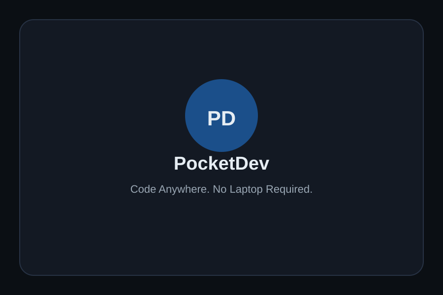
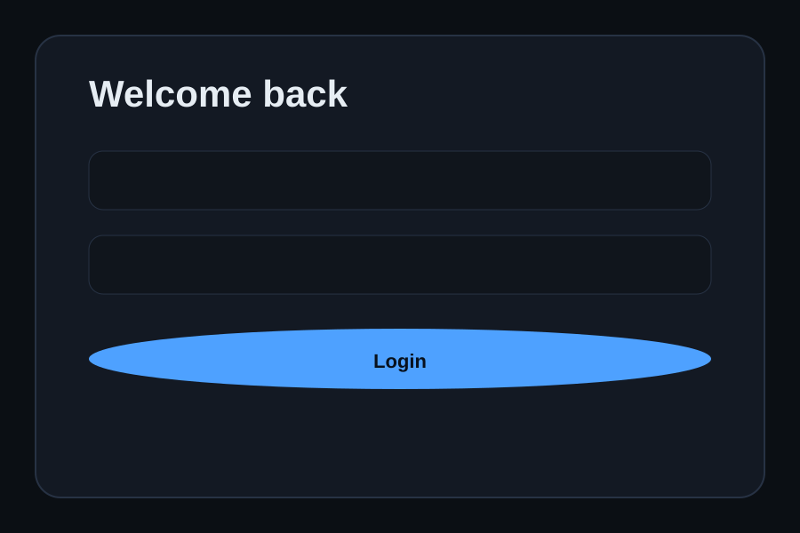
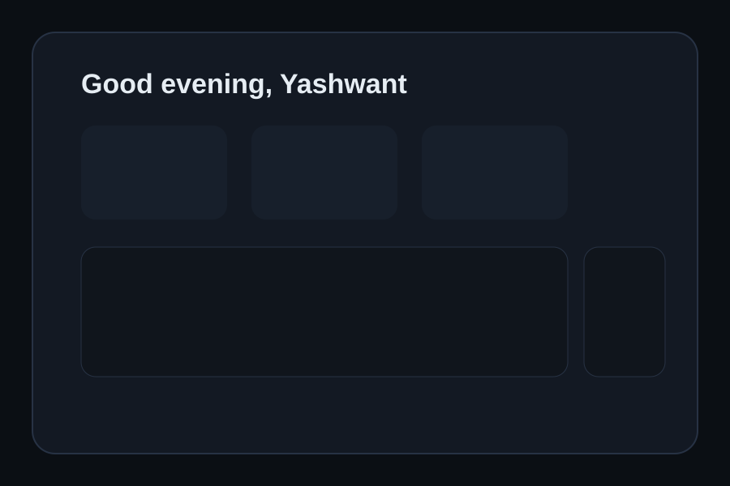
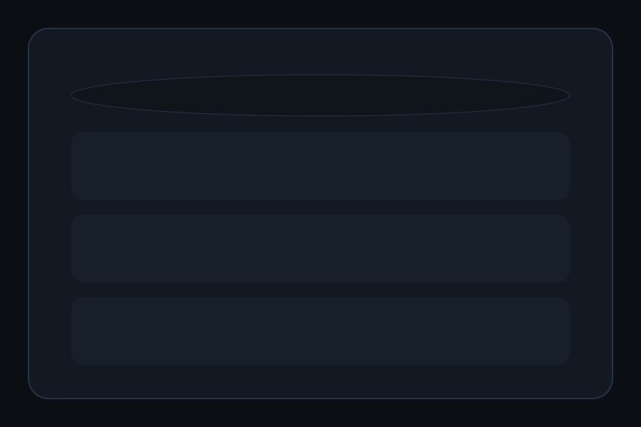
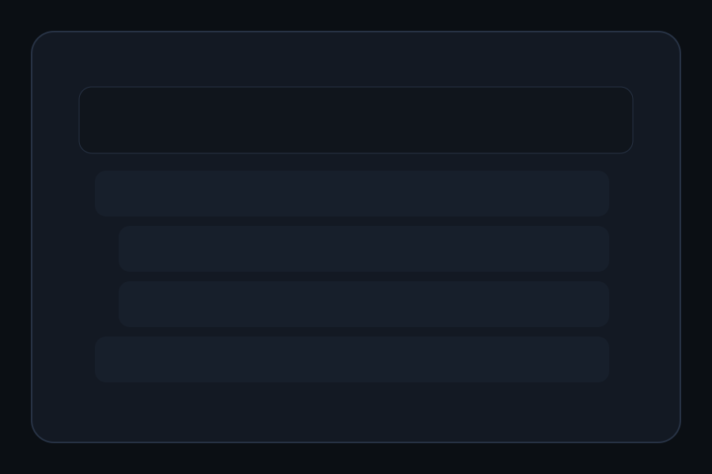
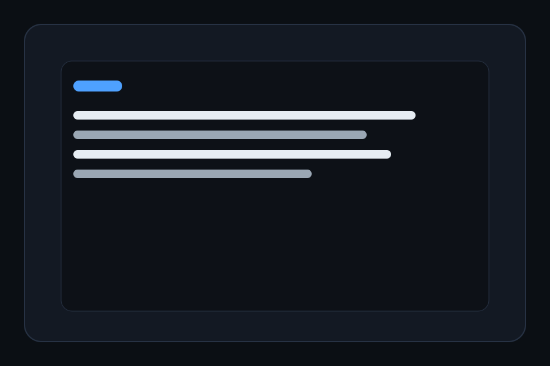
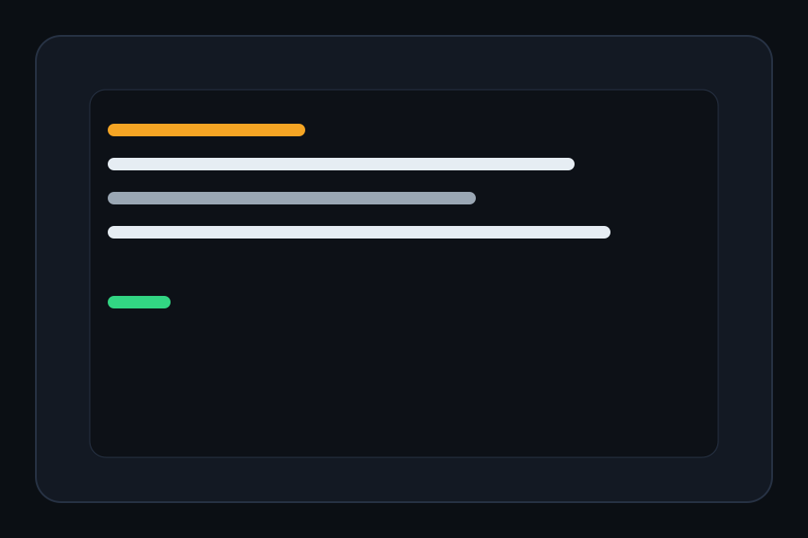
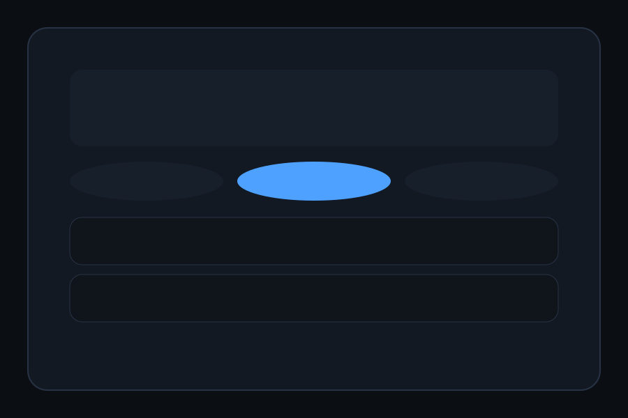
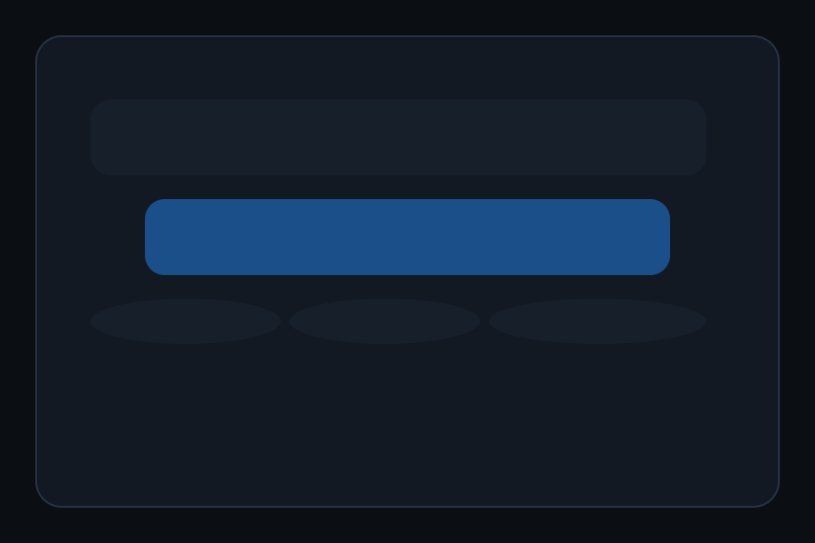
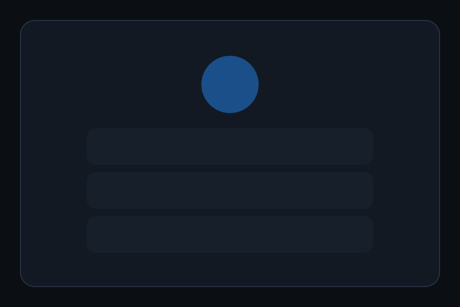

# PocketDev

PocketDev is a mobile-native cloud development environment designed to enable developers to access and manage their projects directly from a smartphone. The application follows a touch-first approach, allowing users to browse files, edit code, execute commands, and perform Git operations through a mobile interface.

> **Note:** This repository currently contains the frontend implementation developed as part of a semester project. The application uses mock data, and backend services are planned for future development.

## Features

* Mobile-first development experience
* Project browsing and management
* Code editor interface
* Terminal interface with simulated command execution
* Git operations interface (Commit, Push, Pull)
* AI assistant interface for error explanation
* File explorer with expandable folders
* Dashboard with project statistics
* Dark theme inspired by modern code editors

## Tech Stack

* React Native
* Expo
* TypeScript
* React Navigation

## Screens

* Splash Screen
* Authentication
* Home Dashboard
* Projects
* File Explorer
* Code Editor
* Terminal
* Git
* AI Assistant
* Profile

## Project Structure

```text
.
├── App.tsx
├── app.json
├── babel.config.js
├── package.json
├── README.md
├── tsconfig.json
├── assets/
│   └── screenshots/
└── src/
    ├── components/
    ├── data/
    ├── navigation/
    ├── screens/
    └── theme/
```

## Screenshots

The images below are lightweight placeholders that mirror the PocketDev screens.

| Splash | Login | Home |
| --- | --- | --- |
|  |  |  |

| Projects | File Explorer | Code Editor |
| --- | --- | --- |
|  |  |  |

| Terminal | Git | AI Assistant |
| --- | --- | --- |
|  |  |  |

| Profile |
| --- |
|  |

## Getting Started

### Prerequisites

* Node.js
* npm or yarn
* Expo CLI

### Installation

Clone the repository:

```bash
git clone https://github.com/your-username/pocketdev.git
```

Navigate to the project directory:

```bash
cd pocketdev
```

Install dependencies:

```bash
npm install
```

### Run the App

Start the development server:

```bash
npx expo start
```

Run on Android:

```bash
npx expo start --android
```

Run on iOS:

```bash
npx expo start --ios
```

If you are using a physical phone, install the Expo Go app and scan the QR code shown in the terminal or browser.

## Future Enhancements

* Backend integration
* User authentication and authorization
* Cloud-based project synchronization
* Real-time terminal execution
* Docker container integration
* AI-powered code assistance
* GitHub integration
* Subscription management

## License

This project was developed for academic purposes as part of a semester project.
